#  Spring Framework

 ## 💡 `Notice_Board` [스프링 게시판]
 
 ---

    


---

### 🧾 프로젝트 소개 

---

>**ECLIPSE 환경 구축**

> 1. ECLIPSE 설치
> 2. JDK 설치
> 3. Oracle 설치(ojdbc6.jar)
> 4. Tomcat 설치

> 5. Spring Framework 설치
> 6. Web Developer Tools 설치


---

#### 1️⃣ complete - 메인 화면, 로그인 화면, 회원 관리, 게시판

<br>

##### ◾ 메인 화면

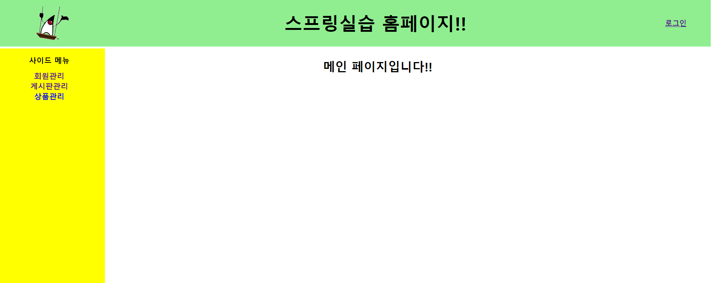

<br>

##### ◾ 로그인 화면


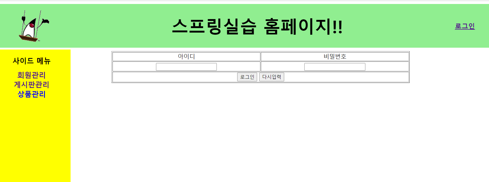
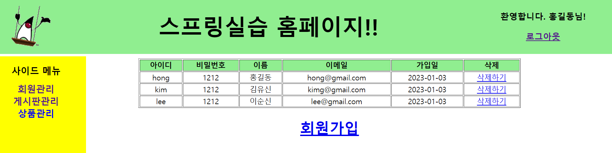

##### 입력 없이 로그인 눌렀을 때
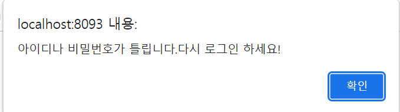

<br>

##### ◾  게시판

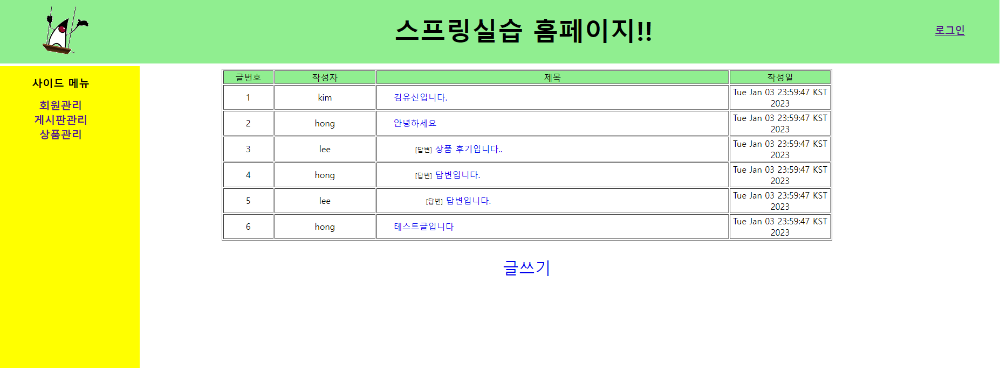

<br>

---


###### ◾  게시판 날짜 형태 수정 ( java.util.Date &roarr; java.sql.Date )

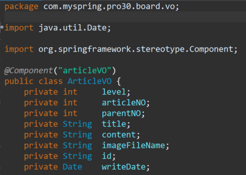 
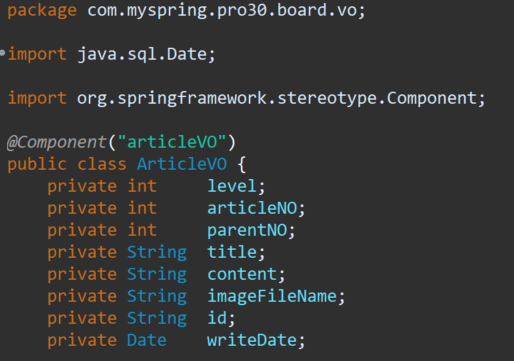

<br>

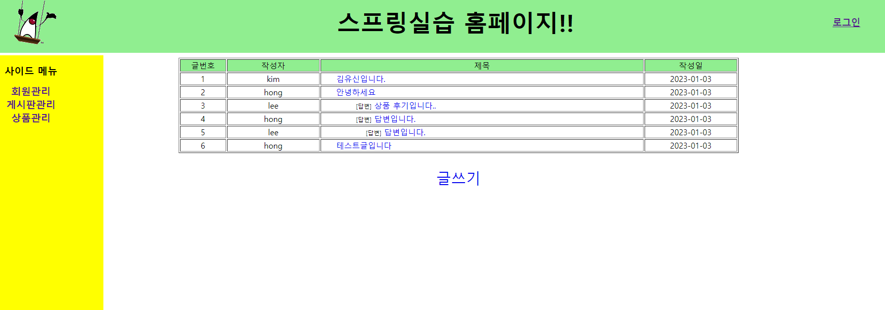

---

###### ◾  aop 활용

@EnableAspectJAutoProxy 주석처리

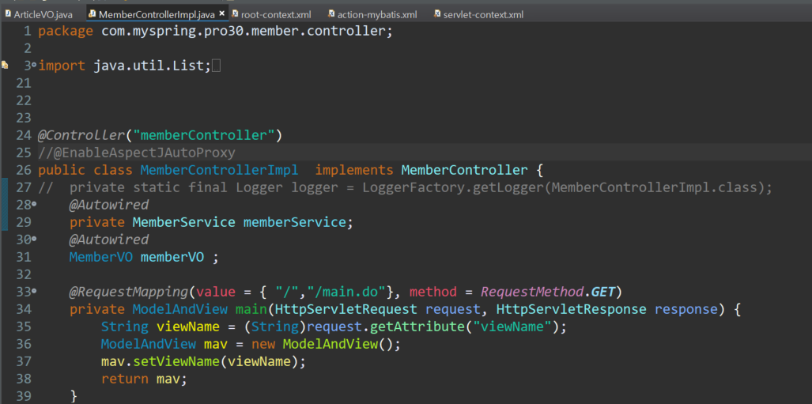 

aop를 추가 및 체크

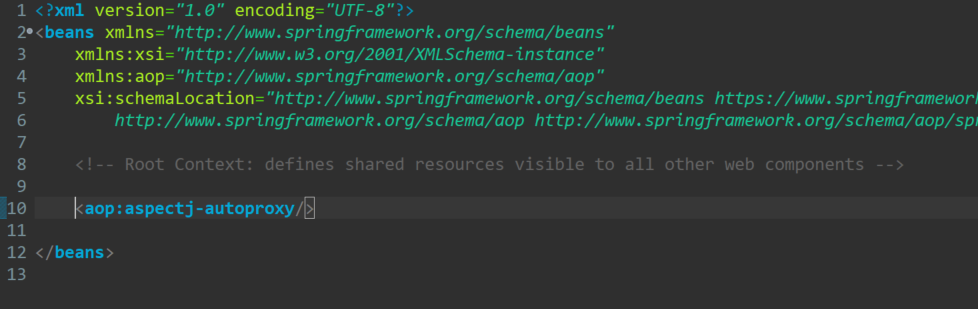


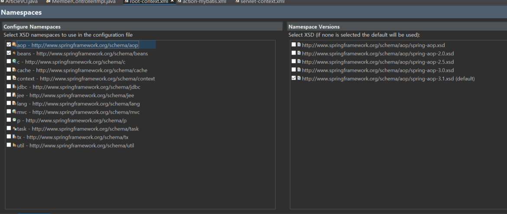

---
---

#### 2️⃣ complete - 새 글 등록, 글쓰기(파일 업로드)

<br>

##### ◾ 새 글 등록 - 로그인 후 이용 가능 메시지

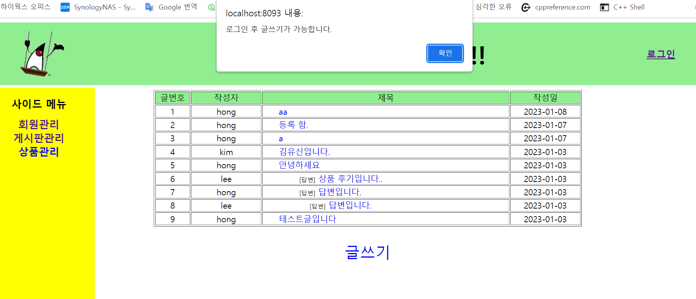

<br>

##### ◾ 로그인 후 새 글 등록

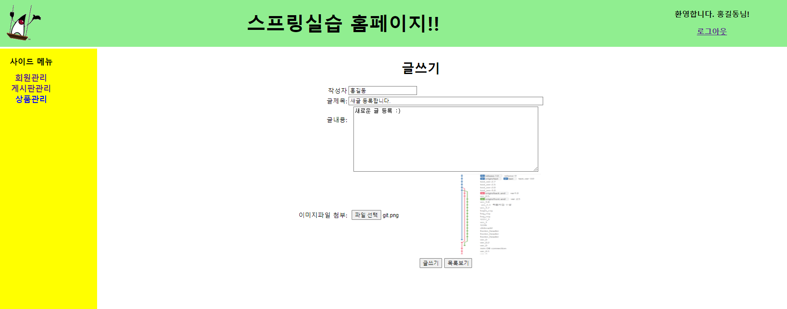

##### ◾ 새 글 등록 메시지

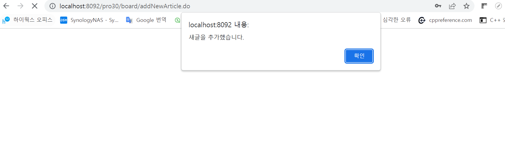

<br>

##### ◾ 새 글 등록 완료(파일 등록 완료)

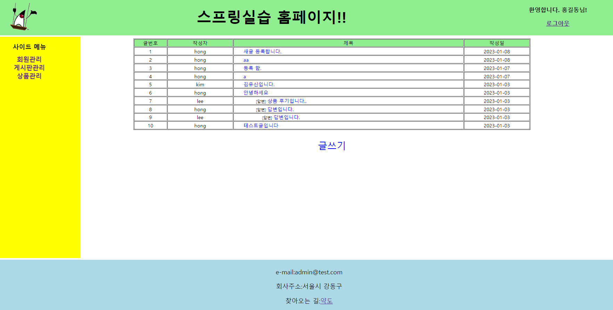

##### ◾ 데이터 베이스 등록 완료

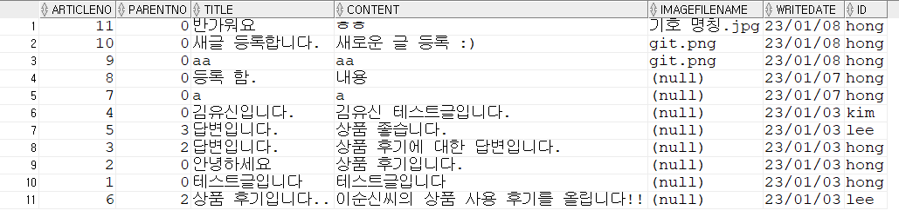


##### ◾ 지정된 경로로 파일 저장 완료
###### 경로: [ARTICLE_IMAGE_REPO = "C:\\board\\article_image"]


<br>

> p.s
```
▶ 서버 실행하자마자 접속한 후 글쓰기 눌렀을 때 가끔 로그인 없이 들어가지는 버그 존재

▶▶▶ 이럴 땐, 새로고침 하거나 로그인 했다가 로그아웃 한 후에 다시 하면 정상 작동

```
---
---

### CRUD 기능

<br>

#### 3️⃣ - 1️⃣ complete - 글 상세 보기 [SELECT]

<br>

##### ◾ 글 상세 보기 (1) - 로그인 하지 않은 경우

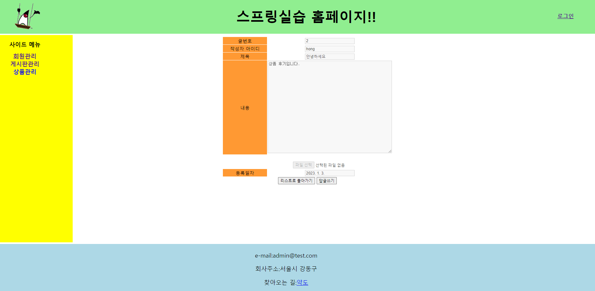

<br>

##### ◾ 글 상세 보기 (2) - 로그인(일반 회원)

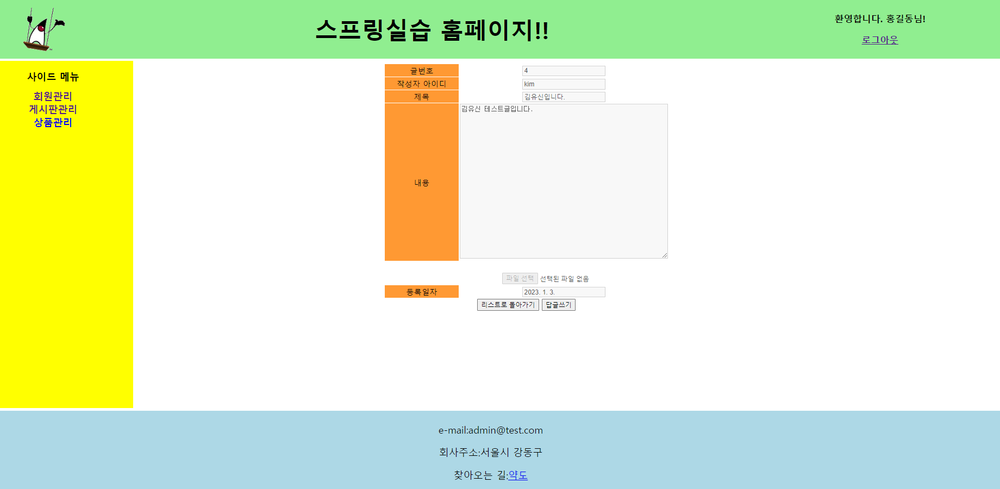

<br>

##### ◾ 글 상세 보기 (3) - 로그인(작성자)

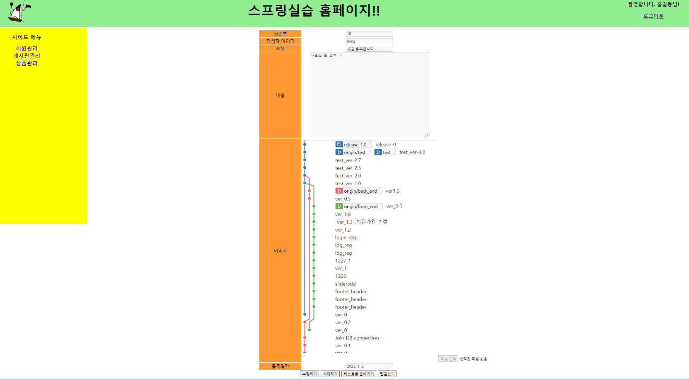

---

<br>


<!--1️⃣ 2️⃣ 3️⃣ 4️⃣ 5️⃣ 6️⃣ 7️⃣ 8️⃣ 9️⃣ -->


