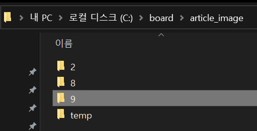

#  Spring Framework

 ## 💡 `Notice_Board` [스프링 게시판]
 
 ---

    


---

### 🧾 프로젝트 소개 

---

>**ECLIPSE 환경 구축**

> 1. ECLIPSE 설치
> 2. JDK 설치
> 3. Oracle 설치(ojdbc6.jar)
> 4. Tomcat 설치

> 5. Spring Framework 설치
> 6. Web Developer Tools 설치


---

### ◾ Main, Sub 화면

<br>

#### 1️⃣ complete - 메인 화면, 로그인 화면, 회원 관리, 게시판

<br>

##### ◾ 메인 화면


<br>

##### ◾ 로그인 화면


##### 입력 없이 로그인 눌렀을 때


<br>

##### ◾  게시판


<br>

---


###### ◾  게시판 날짜 형태 수정 ( java.util.Date &roarr; java.sql.Date )

 


<br>


---

###### ◾  aop 활용

@EnableAspectJAutoProxy 주석처리

 

aop를 추가 및 체크


---
---

### ◾ CRUD 기능

<br>

#### 2️⃣ complete - 새 글 등록, 글쓰기(파일 업로드)

<br>

##### ◾ 새 글 등록 - 로그인 후 이용 가능 메시지


<br>

##### ◾ 로그인 후 새 글 등록


##### ◾ 새 글 등록 메시지


<br>

##### ◾ 새 글 등록 완료(파일 등록 완료)


##### ◾ 데이터 베이스 등록 완료


##### ◾ 지정된 경로로 파일 저장 완료
###### 경로: [ARTICLE_IMAGE_REPO = "C:\\board\\article_image"]


<br>

> p.s
```
▶ 서버 실행하자마자 접속한 후 글쓰기 눌렀을 때 가끔 로그인 없이 들어가지는 버그 존재

▶▶▶ 이럴 땐, 새로고침 하거나 로그인 했다가 로그아웃 한 후에 다시 하면 정상 작동

```
---


#### 3️⃣ - 1️⃣ complete - 글 상세 보기 [SELECT]

<br>

##### ◾ 글 상세 보기 (1) - 로그인 하지 않은 경우


<br>

##### ◾ 글 상세 보기 (2) - 로그인(일반 회원)


<br>

##### ◾ 글 상세 보기 (3) - 로그인(작성자)


---

#### 3️⃣ - 2️⃣ complete - 글 수정 [UPDATE]

<br>

<이미지를 다른 이미지로 변경하며 글 수정>

##### ◾ 수정하기 - 아래 '수정' 버튼 누르기


<br>

##### ◾ 수정하기 - '수정반영하기' 버튼 활성화 / 파일 업로드 활성화


<br>

##### ◾ 수정하기 - 이미지 변경(내용 변경)


##### ◾ 수정 메시지


<br>

##### ◾ 수정 결과


##### ◾ 이미지 수정 전


##### ◾ 이미지 수정 후


<br>

<일반 글에 이미지 추가>

##### ◾ 수정하기 - 글에 이미지 추가


##### ◾ 이미지 추가(폴더 생성 후 이미지 저장)


---

#### 3️⃣ - 3️⃣ complete - 글 삭제 [DELETE]

<br>

##### ◾ 초기 글 목록 화면


<br>

##### ◾ 삭제 진행 (글번호 7, 8번 삭제)


<br>

##### ◾ 삭제 결과


##### ◾ 삭제 전 · 후 폴더


---
---

#### 4️⃣ - 1️⃣ complete - 글 다중 이미지 등록 [INSERT & `foreach` <u>tag</u>]

<br>

##### ◾ 글 작성 왼쪽 하단의 '파일 추가' 버튼 클릭 할 때마다 '파일 선택' 버튼 생성


###### ◾ 등록 메시지


###### ◾ 데이터베이스 입력 및 폴더에 파일 생성





```
다만, 중복되는 이미지는 여러 이미지 파일로 생성하지 않는다.
(3개 이미지 등록하였지만 2개 이미지 존재)
```

---

<!--1️⃣ 2️⃣ 3️⃣ 4️⃣ 5️⃣ 6️⃣ 7️⃣ 8️⃣ 9️⃣ -->


